<div align="center">

# Rate My Racket


    

</div>

## Table of Contents
1. [Description](#description)
1. [Tech Stack and Packages Installed](#tech_stack)
1. [Install (Run) with Docker](#docker)
1. [Install without Docker](#install)
1. [Structure for Docker-Compose Explained](#structure)
1. [Django Files and Folders of Interest](#django)
1. [React Files and Folders of Interest](#nextjs)
1. [About Nginx Configuration](#nginx)
1. [Useful Links](#useful_links)
1. [Contributing](#contributing)
1. [Screenshots](#screenshots)


<a name="description"></a>
## Description

### What is Rate My Racket?
Rate My Racket is a website that helps tennis players to find the right racket for them based on the specs they are looking for. To so, it offers a rating system that takes into account averages of ratings, the amount of users that have given an opinion about the racket, and how many times a racket has been considered as one of the 3 top choices for a feature and in what position.

### Why Rate My Racket?
Finding a new tennis racket can be challenging and tricky even for advance tennis players as there are plenty of options for all playing styles, wights, and budgets. To select the best racket for a player, many parameters have to be taken into account, from the physical characteristics of the racket (weight, balance, string patters, ...) to the player own style and propose of use. As many rackets share similar specs, reading about player's pass experiences can become helpful to decide. With this in mind, Rate My Racket allows users to both rate rackets and share their experience while playing on the court. I started this project while having trouble deciding between a __Head Graphene 360+ Instinct MP__ or a __Head Graphene 360+ Speed MP__, which is a perfect example of how deciding even between well-known rackets can be tricky.


<a name="tech_stack"></a>
## Tech Stack and Packages Installed

- __Django:__ This is the backbone of the backend api, and has the following packages installed:
    - Django Rest Framework (For the Rest API)
    - Pillow (For managing images uploading)
    - Django-Cors-Headers (For the CORS config to allow React js to make calls)
    - Django-Environ (To Fetch the environment variables in the settings.py files)
    - Psycopg2-binary (To manage the PostgreSQL Database)
    - Gunicorn (To manage the running instance of the django web app)
    - Django-Rest-Knox (To manage Token Based Authentication)

    __Note:__ All this packages are specified in the _requirements.txt_ file inside the __django_backend__ folder. Links to their official documentation can be found at the [Useful Links](#useful_links) section.

- __Next js:__ The frontend framework in use based on React js. This was created via ``npx create-next-app``. The only extra packages that were installed (ignoring the ones that are automatically pre-installed) are:
    - Bootstrap and React-Bootstrap (For styling)
    - Axios (To make calls to the Django Backend)

- __Nginx:__ This is the server for the Docker-Compose testing build. The default configuration in use can be found at the __nginx/nginx.conf__ file.

- __PostgreSQL:__ This is the default configured database for this repository. A link to _How to install/configure it for Linux/Windows/MacOS_ is included in the [Useful Links](#useful_links) section (This is only necessary for when not running with docker-compose). In addition, a link to _How to change to MySQL in Django_ is included as well in the [Useful Links](#useful_links) section.


<a name="docker"></a>
## Install (Run) with Docker

1. Clone the repo:
    ```bash
    git clone https://github.com/Ceci-Aguilera/rate-my-racket.git
    ```
1. Copy a default setup of the environment variables for the project:
    ```bash
    cp example_env .env
    cp rate-my-racket-frontend/example_env rate-my-racket-frontend/.env.local
    cp rate_my_racket_backend/rate_my_racket_backend/settings/example_env rate_my_racket_backend/rate_my_racket_backend/settings/.env
    ```
1. (optional) Edit the values in the previous copied files to create a custom config. Note that the one set by default should work just fine for development.
1. Run Docker-Compose:
    ```bash
    docker-compose up -d --build
    ```

    Congratulations !!! The app should be up and running. To access the __Next js__ frontend go to [localhost:3000](http://localhost:3000), and to access the __Django__ backend go to [localhost:80](http://localhost:80).

1. (optional) To create a super user:
    ```bash
       docker-compose run backend ./manage.py createsuperuser 
    ```

<a name="install"></a>
## Install without Docker

1. Clone the repo:
    ```bash
    git clone https://github.com/Ceci-Aguilera/rate-my-racket.git
    ```

1. Copy a default configuration of the environment variables for Django:
    ```bash
    cp rate_my_racket_backend/rate_my_racket_backend/settings/example_env rate_my_racket_backend/rate_my_racket_backend/settings/.env
    ```
1. (optional) Edit the values in the previous file that was copied to create a custom config. Note that the one set by default should work just fine for development.

1. Set up the database. In this case the one in use by default is PostgreSQL. Assuming that PostgreSQL is already installed in the OS, and that the needed configurations for PostgreSQL to run in the OS are done, create a database and an user using the credentials specified in the __rate_my_racket_backend/rate_my_racket_backend/settings/.env__ file that was just created/edited.
__Note:__ To now how to install and configure PostgreSQL, see the [Useful Links](#useful_links) section of this documentation. 

1. Change the default settings.py file in use from docker to development. To do this, go to the file __rate_my_racket_backend/rate_my_racket_backend/settings/\_\_init\_\_.py__ and modify the line
    ```python
    from .docker import *
    ```
    to
    ```python
    from .dev import *
    ```

1. Create and activate a virtual environment (See the [Useful Links](#useful_links) section if not know how)

1. Install the necessary dependencies
    ```bash
    cd rate_my_racket_backend
    pip install -r requirements.txt
    ```

1. Run Django:
    ```bash
    cd rate_my_racket_backend
    python manage.py makemigrations
    python manage.py migrate
    python manage.py runserver
    ```

1. To configure React, from the project root folder go to __rate-my-racket-frontend__ and install the necessary dependencies:
    ```bash
    cd rate-my-racket-frontend
    npm install
    ```


1. Run React while inside the __rate-my-racket-frontend__ folder:
    ```bash
    npx next dev
    ```

Congratulations !!! The app should be up and running. To access the __Next js__ frontend go to [localhost:3000](http://localhost:3000), and to access the __Django__ backend go to [localhost:8000](http://localhost:8000).


<a name="structure"></a>
## Structure for Docker-Compose Explained

This repository is divided into 3 main folders (not counting the .readme_assets as it contains only the images displayed in the Readme). These folders are:
- __rate_my_racket_backend:__ Has the Django project created with ``django-admin startproject``.
- __rate-my-racket-frontend:__ Has the Next js project create with ``npx create-next-app``.
- __nginx:__ Has the Dockerfile used in the docker-compose.yml file and the default config to run Django + Next js. When running the project locally without Docker this folder can be ignored.

Each project (Django and Next js as separate projects) is intended to be self contained, and so it can be separately tested  without the need of docker-compose.

When running with __Docker Compose__, there are 4 images that are created: A Django backend Image, a Next js frontend Image, a Nginx Image, and a PostgreSQL Image. The Dockerfiles for Django, Next js, and Nginx can be found in their respective folders, i.e, the Django Dockerfile is inside the rate_my_racket_backend folder, and so on. The PostgreSQL image has no custom Dockerfile, instead it is pulled from the Docker Hub, and the environment variables for the docker-compose file can be found at the .env file in the project root folder. This repository does not include that file, instead it offers an example_env file that can be renamed to .env and it should work out of the box (the default environment variables set do not need to be modified).


<a name="django"></a>
## Django Files and Folders of Interest
So far, there is no app created for Django, and so, the only important folder so far is the settings folder inside the __rate_my_racket_backend/rate_my_racket_backend__ folder. This contains different settings.py files for different environment. For example, the dev.py file has the default settings to run in the development environment, while the docker.py file has the default settings to run when using docker-compose. All of these files has the base.py file as their parent file (the base.py file has the settings to be shared among the environments), and so they all should have

```python
from .base import *
```

as their first line. To change between environments, go to the __rate_my_racket_backend/rate_my_racket_backend/\_\_init\_\_.py__ file and edit its first line. By default it should be

```python
from .docker import *
```

To change to the environment ``x``, replace that line with

```python
from .x import *
```

Next, the __templates__, __static__, and __media__ folders have been created (and configured in the settings) to store the hml, css, ... files.

The Django Project only has 2 apps in use, the accounts_app to manage users, and the comments_rackets_app to manage the comments and ratings of the rackets.

<a name="nextjs"></a>
## Next js Files and Folders of Interest

Aside from the __package.json__ and the __src/index.js__ files there are no other edited files in this folder.

The following structure is used by the owner of this repository when working on the Next js project:
```text
    rate-my-racket-frontend
        |____ components
        |____ pages
        |____ styles
        |____ assets
```

Inside the pages folder, there should be a folder named credentials, that managed the user-account related views, such as register, login, view account, ...

The rest of the folder are racket-related, which means that they contain the views related to the comments, ratings, ... of  the rackets. The grids, cards, and other constructions used to display the comments and the rackets are implemented as components, and so they can be found at the components folder. However, some of the pages that do not required heavy UI/UX components have the components embedded as part of the code instead of having them imported from the components folder.

The context folder has the AuthContext file used to globally manage the user states.

All the axios calls are implemented at the pages (not at the components), and sometimes so the pages pass properties and helper functions to the components.


<a name="contributing"></a>
## Contributing

Inputs and contributions to this project are appreciated. To make them as transparent and easy as possible, please follow this steps:

- ### How to contribute:
    1. Fork the repo and create your branch from master
    1. Clone the project to your own machine
    1. Commit changes to your own branch
    1. Update documentation
    1. Push your work back up to your fork
    1. Submit a Pull request

- ### How to report a bug:
    1. Open a new Issue.
    1. Write a bug report with details, background, and when possible sample code. That's it!


<a name="useful_links"></a>
## Useful Links

### PostgreSQL and other Databases
- Install/Setup Database in Linux: [Digital Ocean Link for Django Deployment on VPS](https://www.digitalocean.com/community/tutorials/how-to-set-up-django-with-postgres-nginx-and-gunicorn-on-ubuntu-16-04)
- Install/Setup in Windows: [guru99.com Link](https://www.guru99.com/download-install-postgresql.html)
- Install/Setup in MAC OS: [postgresqltutorial.com Link](https://www.postgresqltutorial.com/postgresql-getting-started/install-postgresql-macos/)
- [Django with MySQL](https://dev.to/sm0ke/how-to-use-mysql-with-django-for-beginners-2ni0)

### Docker
- [Docker Oficial Documentation](https://docs.docker.com/)
- Dockerizing Django, PostgreSQL, guinicorn, and Nginx:
    - Github repo of sunilale0: [Link](https://github.com/sunilale0/django-postgresql-gunicorn-nginx-dockerized/blob/master/README.md#nginx)
    - My repo to Dockerize Django + MySQL + Nginx + React js: [Ceci-Aguilera/django-react-nginx-mysql-docker](https://github.com/Ceci-Aguilera/django-react-nginx-mysql-docker)
    - Michael Herman article on testdriven.io: [Link](https://testdriven.io/blog/dockerizing-django-with-postgres-gunicorn-and-nginx/)
### Django and DRF
- [Django Official Documentation](https://docs.djangoproject.com/en/4.0/)
- Generate a new secret key: [Stackoverflow Link](https://stackoverflow.com/questions/41298963/is-there-a-function-for-generating-settings-secret-key-in-django)
- Modify the Django Admin:
    - Small modifications (add searching, columns, ...): [Link](https://realpython.com/customize-django-admin-python/)
    - Modify Templates and css: [Link from Medium](https://medium.com/@brianmayrose/django-step-9-180d04a4152c)
- [Django Rest Framework Official Documentation](https://www.django-rest-framework.org/)
- More about Nested Serializers: [Stackoverflow Link](https://stackoverflow.com/questions/51182823/django-rest-framework-nested-serializers)
- More about GenericViews: [Testdriver.io Link](https://testdriven.io/blog/drf-views-part-2/)
- [Django Pillow](https://pillow.readthedocs.io/en/stable/)
- [Django-Cors-Headers](https://pypi.org/project/django-cors-headers/)
- [Django-Environ](https://pypi.org/project/django-environ-2/)
- [Psycopg2-binary](https://pypi.org/project/psycopg2-binary/)
- [Gunicorn](https://pypi.org/project/gunicorn/)

### Next js
- [Next js Official Documentation](https://nextjs.org/)
- [Bootstrap Official Documentation](https://getbootstrap.com/)
- [React-Bootstrap Documentation](https://react-bootstrap.github.io/)
- [Axios Documentation](https://axios-http.com/docs/intro)

### Miscellaneous
- Create Virual Environment with Virtualenv and Virtualenvwrapper: [Link](https://docs.python-guide.org/dev/virtualenvs/)
- [Configure CORS](https://www.stackhawk.com/blog/django-cors-guide/)
- [Setup Django with Cloudinary](https://cloudinary.com/documentation/django_integration)


<a name="screenshots"></a>
## Screenshots

<div align="center">

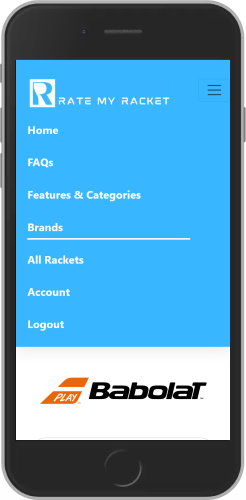 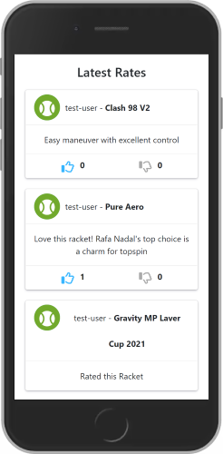 

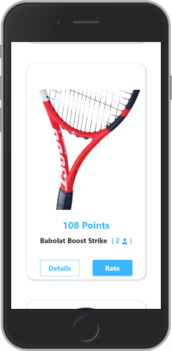 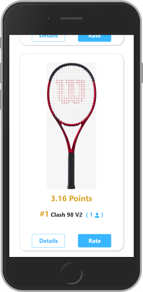 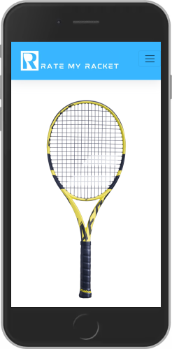

---


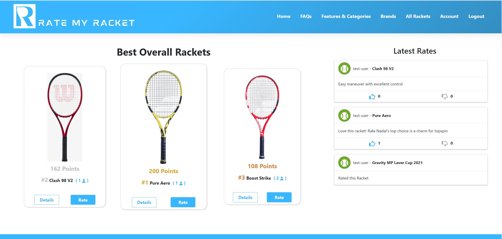

---

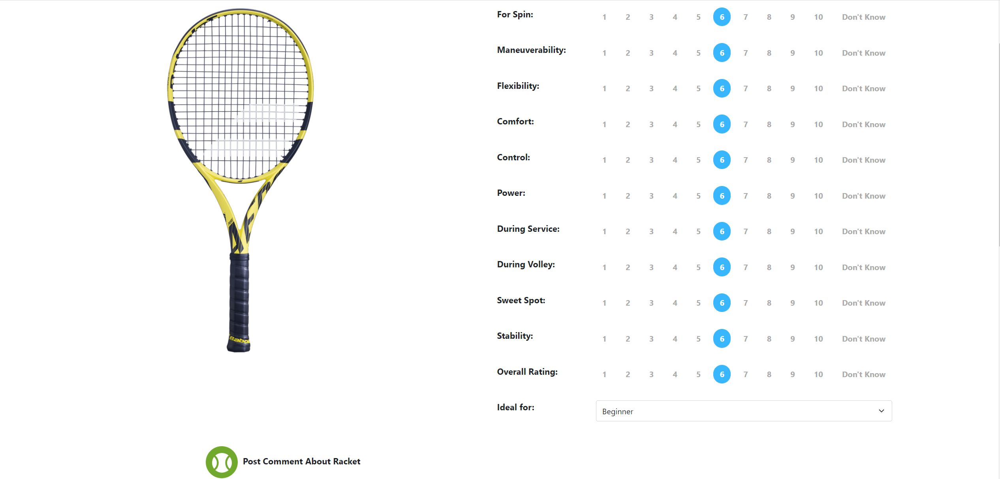

---

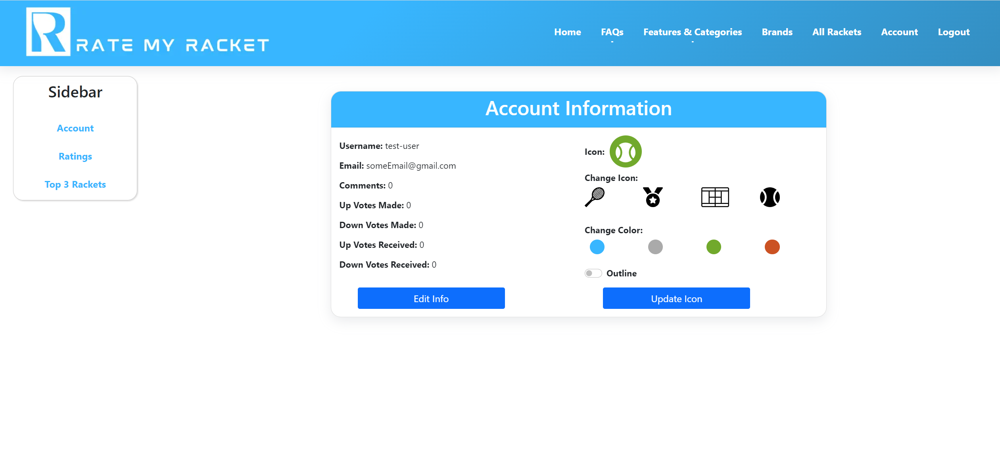

---

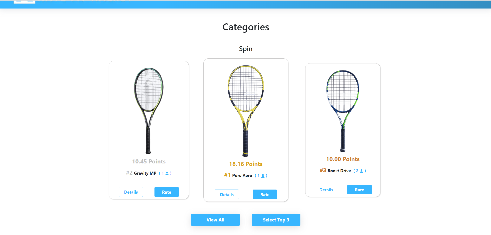

---

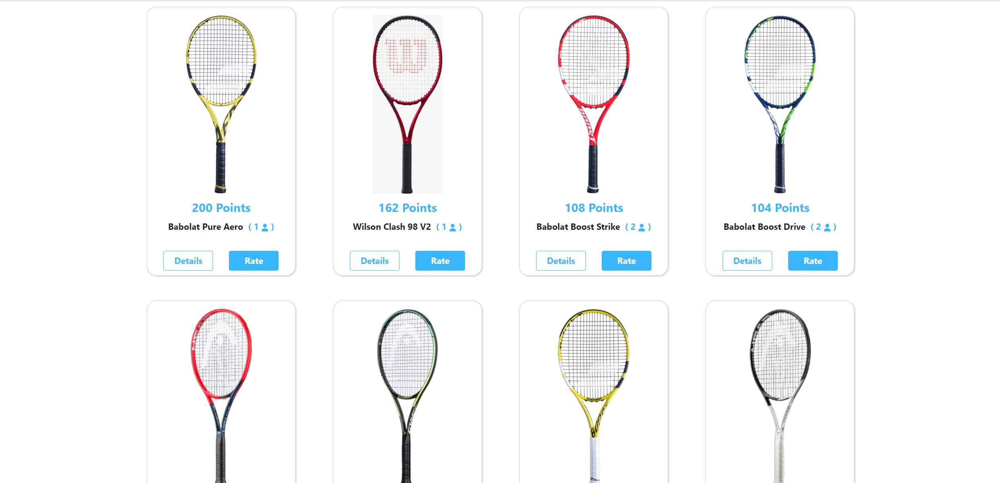

---

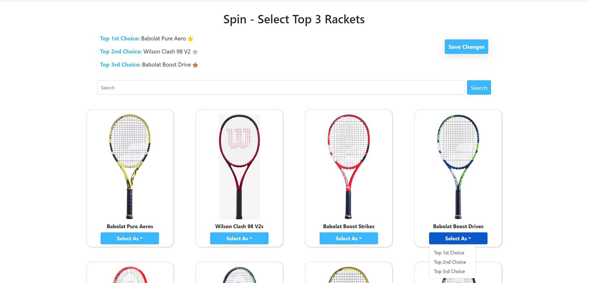

</div>